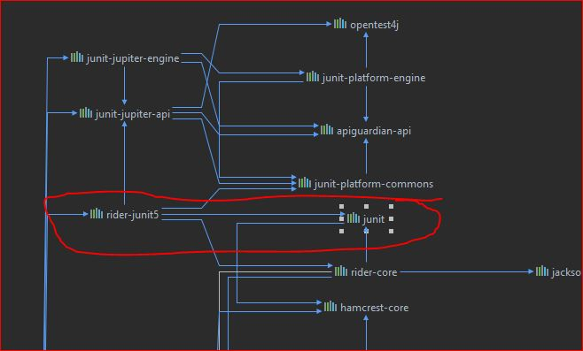

# Overview

This is a library intended to be used by a Spring Boot application. As such, the datasource is auto-configured by Spring Boot as an H2 in-memory db during tests.

If I used this annotation:
`com.github.database.rider.spring.api.DBRider`
it requires having `rider-spring` on the classpath
The test functions, but relies on `TestRule`, via `com.github.database.rider.core.util.EntityManagerProvider`, requiring me to keep JUnit4 as a dependency

If I used this annotation and exlude JUnit 4:
`com.github.database.rider.junit5.api.DBRider`
I get: `java.lang.RuntimeException: JDBC connection url cannot be empty`

# Running
Run the `PlatformRepositoryTest` to see the problem.

# Additional note
Also note that both `rider-junit5` and `rider-core` have a dependency on JUnit 4.

# One problem - three variables I toggled
I want to exclude JUnit 4.

But I also need to use Spring or else I get no JDBC connection url.

`@DBRider` Annotation | JUnit 4 included? | `rider-spring` lib present? | Result 
---                   | ---               | ---                         | ---
`spring`              | Yes               | Must be                     | It works (but JUnit 4 is included)
`spring`              | No                | Must be                     | `java.lang.NoClassDefFoundError: org/junit/rules/TestRule`
`junit5`              | Yes               | Yes                         | `JDBC connection url cannot be empty`
`junit5`              | Yes               | No                          | `JDBC connection url cannot be empty`
`junit5`              | No                | Yes                         | `java.lang.NoClassDefFoundError: org/junit/rules/TestRule`
`junit5`              | No                | No                          | `java.lang.NoClassDefFoundError: org/junit/rules/TestRule`

